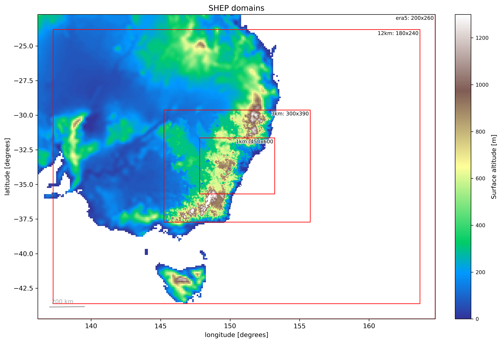

# rAM_SHEP
ACCESS-rAM3 simulations for the CORDEX Sub-Hourly Extreme Precipitation (SHEP) Australasia project

## Contributions

- Leena Khadke: project management, experiment design, analysis
- Jason Evans: project supervison, experiment design
- Mathew Lipson: model setup, ancillary generation, experiment design, running models, documentation

# Setup

**Model**: ACCESS-rAM (with OSTIA varying sea surface temperature)  
**Period**: 2016‑01‑27 to 2016‑01‑31 UTC  
**Boundaries**:

- ERA5 for atmosphere initialisation and lateral boundaries  
- BARRA-R2 for land initialisation  
- OSTIA for sea surface temperature

**Nests**:  

1. GAL9 at 12.2km
2. RAL3p2 at 3km
3. RAL3p2 at 1km  

**Model suite repository**: TBC  

# Domain

Code to plot: [ancil_generation/plot_domains.py](ancil_generation/plot_domains.py).

## Instructions to run:

See [ancils README](ancil_generation/README.md) if they need creation, then to run experiments:

`TBC`

## Analysis

