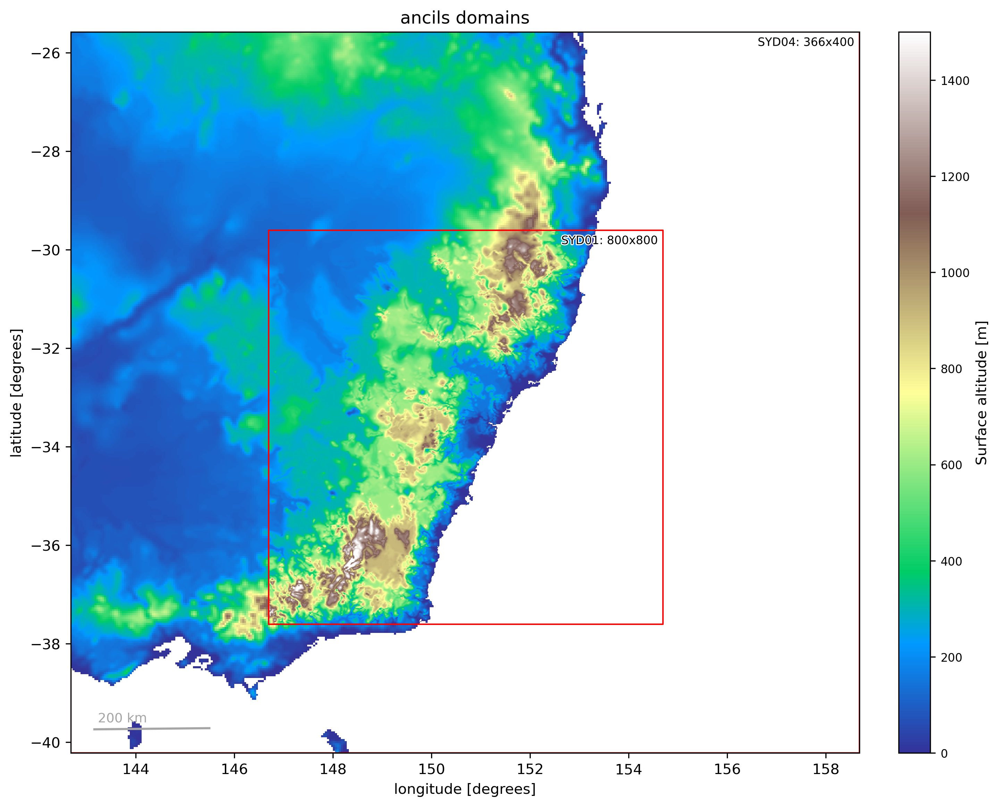
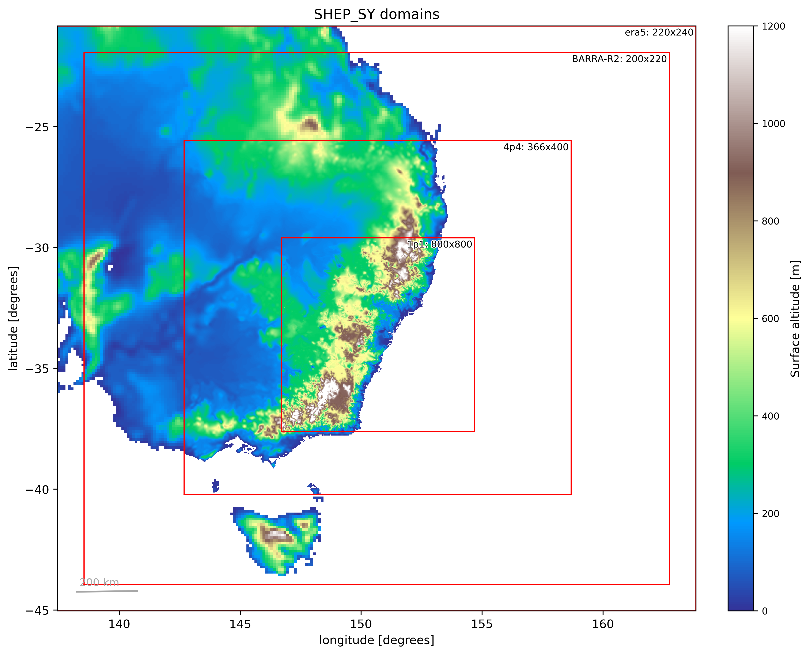

# Cases

Extreme events (local time)

Case 1: 29-01-2016 21:30  
Case 2: 02-12-2023 19:20  
Case 3: 16-12-2010 13:00  
Case 4: 14-03-2019 19:30  

Initialize 2 days before peak of event and continue for 1 day after

UTC+11: 29-01-2016 21:30 -> 29-01-2016 10:30

Therefore start before 27-01-2016 10:30 UTC

# Ancils

Emma's domain is 1.1 km grid centred on Sydney, with a 4.4 km offset to the south (to be confirmed why):



These files are located at

```
/g/data/tp28/dev/SHEP/ancils/SYD04
/g/data/tp28/dev/SHEP/ancils/SYD01
```

I believe Emma's landcover data is similar to BARRA, so using CCIv2 with urban updates from WorldCover.

rAM3 ancils use CCIv1 with urban updates from WorldCover. rAM3 also requires outer nests for the ERA5 driving data, and the BARRA-R2 initialisation domain. When we match our 4.4 km and 1.1 km to Emmas, then, our domains are:



These files are located at: 

```
/scratch/ng72/mjl561/cylc-run/ancils_SHEP_SY/share/data/ancils/
```

## Steps to produce Ancils

1. Checkout the standard Regional Ancillary Suite (u-bu503).

2. Copy the optional file [rose-suite-ancils_SHEP_SY.conf](rose-suite-ancils_SHEP_SY.conf) from this repository to your u-bu503/opt directory:

`cp rose-suite-ancils_SHEP_SY.conf ~/roses/u-bu503/opt/`

where SY is the city of interest (e.g. Sydney).

3. Run the suite with the optional file (and a custom name if desired):

`rose suite-run -O ancils_SHEP_SY --name=ancils_SHEP_SY`

## Steps to run model

1. Checkout rAM3 (u-by395_nci_access_ram3).

2. Copy the optional file [rose-suite-SHEP_SY1.conf](rose-suite-SHEP_SY1.conf) from this repository to your u-by395_nci_access_ram3/opt directory:

`cp rose-suite-SHEP_SY1.conf ~/roses/u-by395_nci_access_ram3/opt/`

where SY is the city of interest (e.g. Sydney), and 1 is the case number (e.g. 1 for Case 1).

3. Run the suite with the optional file (and a custom name if desired):

`rose suite-run --name=SHEP_SY1 -O rAM3_SHEP_SY1`

## Compute

For the 1.1 km task on 24*24 = 576 cores (with Emma's additional outputs), resources were:

```
======================================================================================
                  Resource Usage on 2026-02-25 22:34:06:
   Job Id:             161601756.gadi-pbs
   Project:            ng72
   Exit Status:        0
   Service Units:      1369.28
   NCPUs Requested:    576                 CPU Time Used: 677:03:38       
   Memory Requested:   2.2TB                 Memory Used: 508.79GB        
   Walltime Requested: 03:00:00            Walltime Used: 01:11:19        
   JobFS Requested:    1.17GB                 JobFS Used: 0B              
======================================================================================
```

